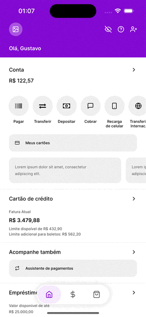

<div align="center" style="margin-bottom: 20px">

  

   <h2 align="center">
    React Native Nubank Home Clone
  </h2>

</div>

Simple Nubank app home clone made with react native

## 🎨 Preview

|                                |                                |                                |
| ------------------------------ | ------------------------------ | ------------------------------ |
|  |  |  |

## 🚀 Installing and Running

Clone the repository

```console
$ git clone https://github.com/gstcarv/nu-react-native
```

Install the dependencies and start

```console
$ yarn install
$ npx expo start
```

## Thanks

with ❤️ by Gustavo
